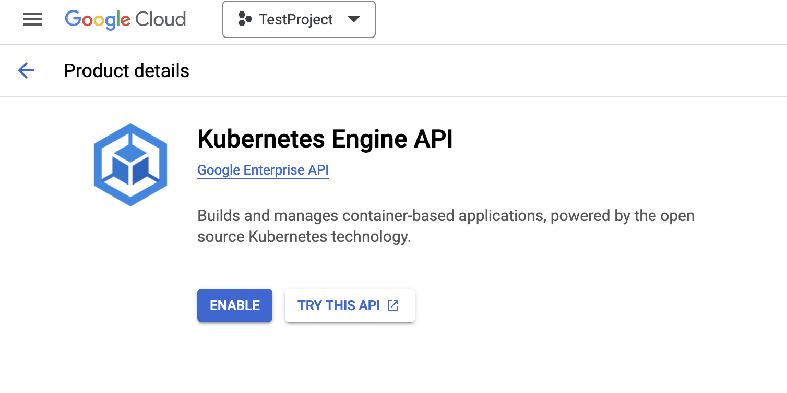
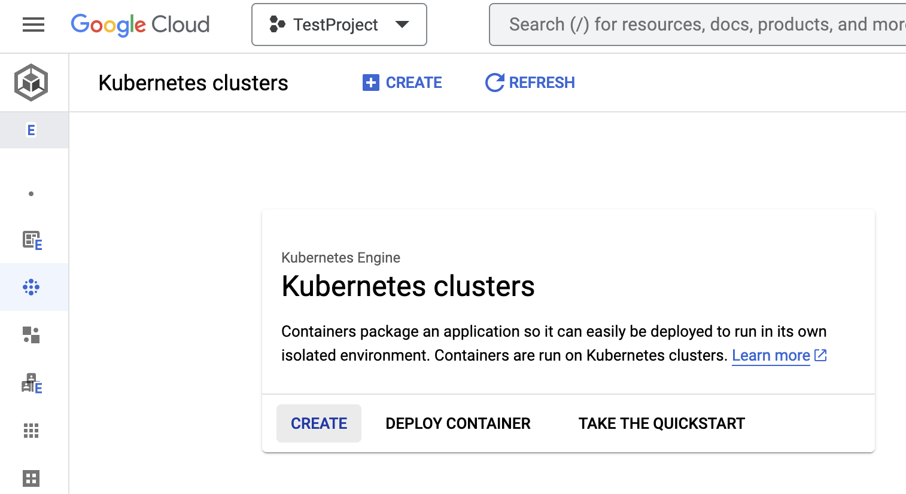

= Elastic Kubernetes Service - EKS
:toc: right
:imagesdir: images
:experimental:

Instructions on setting up a managed k8s cluster on Amazon Web Services (AWS)

== Prerequisites

You will need the following:

An Amazon account:: Sign up or log in to https://aws.amazon.com/[AWS] where you will create the k8s cluster. TODO Verify

aws cli:: Command-line tool to manage resources in AWS. Get it https://docs.aws.amazon.com/cli/latest/userguide/cli-chap-getting-started.html[Amazon].

eksctl:: Amazons version of Kubectl, eksctl, allows you to run commands against Kubernetes clusters. Download it from https://github.com/eksctl-io/eksctl#installation[Github]

== Create an EKS cluster

TODO

. *Enable the Kubernetes Engine API*. If the kubernetes engine API is not enabled for your GCP project, you need to enable it. 
+

+
. Click btn:[Create] to launch the k8s cluster wizard. 
+

+
. Follow the cluster creation steps by setting the values based on your cluster needs. 
+
WARNING: Make sure to chose kubernetes version >= 1.27 which is requried by XP operator.

== Connect to the cluster

. Once the k8s cluster is created, click the cluster name
. Then click btn:[Connect] on the top middle section of the page. This shows you the gcloud command you can use to connect to the k8s cluster from your computer.
. Copy and run the gcloud command. If the command outputs `kubeconfig entry generated for <newly-created-k8s-cluster-name>`, it means proper kubectl config is generated on your computer and you are successfully authenticated to the k8s cluster. 
. To verify your access to the k8s cluster run the command
+
[source,terminal]
----
eksctl get namespaces
----
+
This should display the list of namespaces in the newly created k8s cluster. The "Age" column in the output shows how long has it been since the namespaces are created. 

TODO OUTPUT

== Storage classes

When connected to your cluster, list the available storage classes with this command:

[source,terminal]
----
eksctl get storageclasses
----

This should display the list of storage classes provisioned by GKE cluster.

TODO output

=== EFS

To run XP in clustered mode, a <<../storage-classes#, `ReadWriteMany` storage class>> (NFS type filesystem) is required.

Amazon offers a managed service for shared filesystems called https://aws.amazon.com/efs/[Elastic File System (EFS)^]. 
This is an alternative to <<nfs#, running your own NFS server>>. 

To provision an EFS storage for your cluster, follow Amazons own documentation:

. https://docs.aws.amazon.com/efs/latest/ug/gs-step-two-create-efs-resources.html[Create an EFS^] 
. Then, https://aws.amazon.com/blogs/containers/introducing-efs-csi-dynamic-provisioning/[create a storage class with dynamic provisioning]

Once this is configured properly, you may specify `efs` as your shared storage class when [installing the XP operator].

