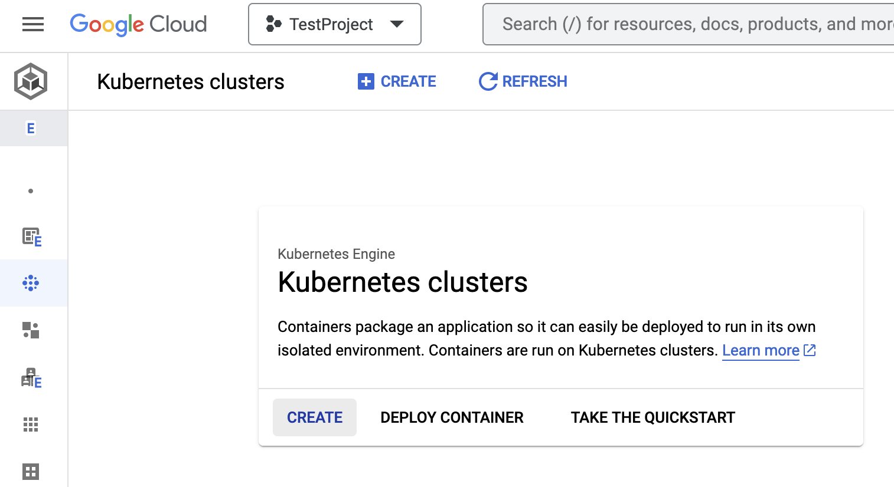

= Google Kubernetes Engine - GKE
:toc: right
:imagesdir: images
:experimental:

Instructions on setting up a managed k8s cluster on Google Cloud Platform - GCP

== Prerequisites

You will need the following:

A Google account and project:: Log in to https://cloud.google.com[GCP], and select or create a `Project` where you will create the k8s cluster. 

Gcloud CLI:: Command-line tool to manage resources in GCP. Download it https://cloud.google.com/sdk/docs/install[here]

Kubectl:: The Kubernetes command-line tool, kubectl, allows you to run commands against Kubernetes clusters. Download it from https://kubernetes.io/docs/tasks/tools/install-kubectl/[Kubernetes.io].

== Create a GKE Cluster

. *Enable the Kubernetes Engine API*. If the kubernetes engine API is not enabled for your GCP project, you need to enable it. 
+
image::../images/gkeEnablek8sapi.png[Enable API]
+
. Click btn:[Create] to launch the k8s cluster wizard. 
+

+
TIP: If you don't get see this page, Choose `Kubernetes Engine` -> `clusters` from the main menu.
+
. The XP Operator *does not support Autopilot clusters*, choose the `Standard` clusters instead.
+
. Follow the cluster creation steps by setting the values based on your cluster needs. 
+
WARNING: Make sure to chose kubernetes version >= 1.27 which is requried by XP operator.

== Connect to the cluster

. Once the k8s cluster is created, click the cluster name
. Then click btn:[Connect] on the top middle section of the page. This shows you the gcloud command you can use to connect to the k8s cluster from your computer.
. Copy and run the gcloud command. If the command outputs `kubeconfig entry generated for <newly-created-k8s-cluster-name>`, it means proper kubectl config is generated on your computer and you are successfully authenticated to the k8s cluster. 
. To verify your access to the k8s cluster run the command
+
[source,terminal]
----
kubectl get namespaces
----
+
This should display the list of namespaces in the newly created k8s cluster. The "Age" column in the output shows how long has it been since the namespaces are created. 

== Storage classes

XP will require specific storage classes in order to work properly. List the available storage classes using the following command:

[source,terminal]
----
kubectl get storageclasses
----

TODO: Example

This should display the list of storage classes provisioned by GKE cluster.

== Teardown

Once you are done with your cluster, you can delete the k8s cluster from the GCP console or using gcloud cli:

[source,bash]
----
gcloud container clusters delete <CLUSTER_NAME> --region <REGION_NAME>
----
